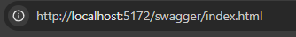
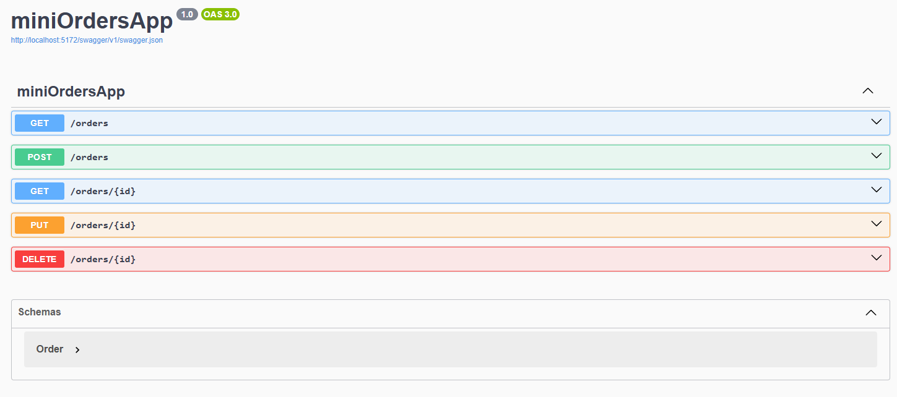

``` markdown
#  Mini Orders API

This project is a simple API to manage customer orders. You can view all orders, create new ones, update them, and delete them. It's built with .NET 8 using Minimal APIs.

---

##  How to Run the Backend

### 1. Requirements

Before getting started, make sure you have the following installed:

- [.NET 8 SDK or later](https://dotnet.microsoft.com/en-us/download)
- A code editor like [Visual Studio Code](https://code.visualstudio.com/) or [Visual Studio](https://visualstudio.microsoft.com/)

### 2. Clone the Project

If you have Git installed, you can clone the repository:

```bash
git clone https://github.com/Willianwt2000/MiniOrdersApp-Tecnic-challenger.git
cd backend
cd miniOrdersApp
```

### 3. Run the Project

From the terminal, run:

```bash
dotnet run
```

This will start the server locally.
example
```
http://localhost:<Port>/swagger/index.html
```


---

##  Test the API with Swagger

Open your browser and visit:

```
https://localhost:<Port>/swagger/index.html
```

This will open the Swagger UI where you can test all endpoints.



---

##  Available Endpoints



---

##  Usage Examples

###  Get All Orders

```http
GET /orders
```

Response:

```json
[
  {
    "id": "750c2c81-61a9-4834-8649-925376b7b9c8",
    "client": "Julian",
    "date": "2025-10-02T13:47:46.328605Z",
    "total": 35.5
  },
  {
    "id": "8664d419-653c-4962-bc25-f90c5c4eb1fc",
    "client": "Julian",
    "date": "2025-10-02T13:48:56.8352963Z",
    "total": 35.5
  }
]
```

---

###  Get Order by ID

```http
GET /orders/750c2c81-61a9-4834-8649-925376b7b9c8
```

Response:

```json
{
  "id": "750c2c81-61a9-4834-8649-925376b7b9c8",
  "client": "Julian",
  "date": "2025-10-02T13:47:46.328605Z",
  "total": 35.5
}
```

---

###  Create a New Order

Request Body:
http://localhost:5172/orders

```json
{
  "client": "Julian",
  "total": 35.5
}
```

Response:

```json
{
  "id": "8664d419-653c-4962-bc25-f90c5c4eb1fc",
  "client": "Julian",
  "date": "2025-10-02T13:48:56.8352963Z",
  "total": 35.5
}
```

---

###  Update an Order

```http
PUT /orders/3fa85f64-5717-4562-b3fc-2c963f66afa6
Content-Type: application/json
```

Request Body:

```json
{
  "id": "3fa85f64-5717-4562-b3fc-2c963f66afa6",
  "client": "Willian",
  "total": 950
}
```

Response:

```json
{
  "id": "750c2c81-61a9-4834-8649-925376b7b9c8",
  "client": "Willian",
  "date": "2025-10-02T13:47:46.328605Z",
  "total": 950
}
```

---

###  Delete an Order

```http
DELETE /orders/750c2c81-61a9-4834-8649-925376b7b9c8
```

Response:

```
204 No Content
```

---

##  Validations

- The `Client` field is required and must be longer than 2 characters.
- The `Total` field must be greater than 0.
- The `Date` is automatically assigned when the order is created.

---

##  Important Notes

- Orders are stored in memory (no database).
- Every time the server restarts, all orders are lost.
- Swagger is only available in development mode.

---

You're all set to start using your API  


# FRONTEND  


# Order Management Frontend

This is the frontend app for managing orders. You can view, create, and delete orders.


## How to Run the Frontend

1. Make sure you have **Node.js** installed:  
   https://nodejs.org/

2. Open your terminal.

3. Go to the frontend project folder:
   ```bash
   cd frontend
   cd mini-order-app
   npm install
   pnpm  dev


# How to Use

Click View Orders to see all orders.

Click View button to see order details.

Click Delete button to remove an order.

Click New Order to add a new order.

Fill in the client name and total, then click Create.


# Reflexión personal

Problemas con CORS en el Backend (.NET Core)

Durante el desarrollo del backend, me encontré con problemas relacionados con CORS . Al intentar consumir la API desde el frontend (que corre en un puerto diferente), el navegador bloqueaba las peticiones por seguridad.

era este el error 


Yo crei a ver llamado el metotodo de manera correcta ```app.use("AllowAll")  ``` lo que me llevo varias horas para investigar e inclusive desactivar el antivirus luego descanse y volvi a leer la documentacion y ahi me di cuenta que lo tenia escrito mal el metodo y que era de esta forma ```app.UseCors("AllowAll")``` de esa forma pude solucionar el error.


# Problemas enfrentados con Vue.js 3 y TypeScript

Reactividad y referencias (ref): Al usar Composition API con ref y reactive, no siempre es intuitivo saber cuándo acceder a .value o cuándo trabajar directamente con el objeto. Esto generó algunos errores y confusión al manipular los datos reactivos. por lo menos pude entender que es practicamente como usar un hook de react con ciertas diferencias.

Manejo de eventos y binding con TypeScript Configurar correctamente los eventos y el binding de datos con tipos estrictos requirió algo de práctica. Por ejemplo, entender cómo usar ```v-model ```con tipos y cómo definir métodos en ```<script setup> ```para evitar errores de tipo fue un reto inicial.

Es interesante lo del ```ref y reactive``` y sigo leyendo para comprender mas sobre sus diferencias : 

Tuve un caso donde los datos no se mostraban y es decir tampoco se actualizaba busque en la documentacion alli vi el metodo ```onMounted``` funciona para ejecutar codigos cuando ya esta listo el componente y y carga los datos en pantalla , ejemplo sencillo : lo use para hacer la peticion a la API y cargo los datos cuando la pagina aparecio.